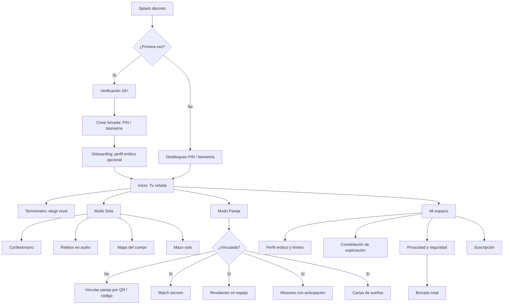
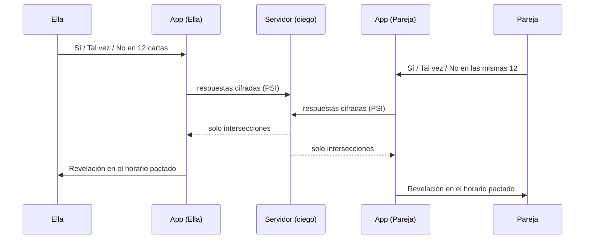

# 3. Arquitectura de pantallas y flujo completo

## 3.1 Mapa general



**Elementos persistentes en todas las pantallas de juego:**
- **Botón Pausa** (arriba a la derecha, color salvia, 44×44 pt mínimo). También se activa agitando el teléfono o diciendo la palabra de pausa elegida (opcional, reconocimiento de voz local).
- **Indicador del termómetro** (arriba a la izquierda): tocarlo permite bajar de nivel en un gesto.
- **Botón “Siguiente”** en cada carta: saltea sin registrar el skip como negativo.
- **Cierre rápido**: deslizar con tres dedos hacia abajo → la app pasa a una pantalla neutra (“Notas” vacía) y se bloquea.

---

## 3.2 Primer uso

### Pantalla 1 — Splash
Luna creciente, fondo noche. Sin texto sexual. Si alguien mira la pantalla, no ve nada comprometedor.

### Pantalla 2 — Verificación 18+
- Paso 1: fecha de nacimiento (bloqueo duro si < 18; no se permite reintentar con otra fecha en el mismo dispositivo durante 24 h).
- Paso 2 (según país y exigencia legal): estimación de edad por selfie con proveedor externo que **no conserva la imagen** (p. ej., Yoti) o verificación con documento vía proveedor certificado. Solo guardamos un token “mayor de edad: sí”, nunca la imagen ni el documento.
- Además se usan las señales de edad del sistema operativo cuando existen (APIs de rango de edad de Apple y Google).
- Copy: *Velada es solo para personas adultas. Verificamos tu edad sin guardar tus datos.*

### Pantalla 3 — Tu bóveda
- Crear PIN de 6 dígitos + activar Face ID / huella (opcional).
- Elegir **PIN señuelo** (opcional): abre una versión vacía de la app.
- Elegir **ícono alternativo** y **estilo de notificaciones** (discreción baja / media / máxima).
- Elegir **palabra de pausa** (por defecto: “Luna”).

### Pantallas 4 a 8 — Perfil erótico (todo opcional, cada paso con “Ahora no”)
| Paso | Pregunta | Formato | Base |
|---|---|---|---|
| 4. Aceleradores | *¿Qué te enciende?* | Chips multiselección: sentirme deseada, palabras, tacto lento, anticipación, novedad, ser mirada, tener el control, entregarme, aromas, música, recuerdos, fantasías… + campo libre | `[CD]` `[AF]` |
| 5. Frenos | *¿Qué te apaga o te distrae?* | Chips: estrés, cansancio, sentirme juzgada, mi cuerpo hoy, falta de privacidad, sentir presión, rutina, apuro… | `[CD]` |
| 6. Límites | *¿Hay algo que no querés ver nunca?* | Lista de temas con interruptor (dolor, lenguaje fuerte, terceras personas, dominación, lugares públicos, fluidos…). Lo que se apaga desaparece de mazos y relatos. | Consentimiento |
| 7. Ritmo | *¿Cómo te gusta ir?* | Deslizador: “Muy despacio” ↔ “Directo al grano”. Define cuánto tarda en sugerir subir de nivel y la duración de las misiones. | `[AN]` `[DR]` |
| 8. ¿Con quién? | *¿Cómo vas a usar Velada?* | Sola / En pareja / Las dos cosas / Todavía no sé | — |

El perfil se guarda **cifrado localmente**. Genera un “Mapa de aceleradores y frenos” visual que ella puede revisar y editar.

---

## 3.3 Inicio — “Tu velada”

```
┌──────────────────────────────────┐
│ 🌡 Brasa            ⏸ Pausa     │
│                                  │
│  Buenas noches.                  │
│  ¿Qué tenés ganas de explorar?   │
│  (o de descubrir si tenés ganas) │
│                                  │
│ ┌──────────┐  ┌──────────┐      │
│ │  SOLA    │  │  PAREJA  │      │
│ └──────────┘  └──────────┘      │
│                                  │
│  ✉ Sobre lacrado: se abre 21:00 │
│  🎧 Relato sugerido · 7 min      │
│  ✦ Nueva estrella en tu          │
│    constelación                  │
└──────────────────────────────────┘
```

- **Sugerencia de “3 minutos”** siempre visible: un audio o carta cortos para quien no tiene ganas previas pero quiere darse el espacio `[DR]`.
- Sin métricas de frecuencia sexual, sin rachas, sin “hace 5 días que no…”.

---

## 3.4 Termómetro

| Nivel | Nombre | Qué incluye | Acceso |
|---|---|---|---|
| 1 | **Chispa** | Palabras, recuerdos, miradas, sensorialidad sin contacto sexual | Libre |
| 2 | **Brasa** | Tacto no genital, recuerdos más íntimos, primeras fantasías románticas | Libre |
| 3 | **Fuego** | Fantasías explícitas en lenguaje sensual, autoplacer mindful, juego de roles leve | Libre (freemium limitado) |
| 4 | **Volcán** | Juegos de poder consensuado, intensidad, novedad fuerte | Premium |
| 5 | **Sin filtro** | Máxima apertura, lenguaje directo, fantasías que no se contarían en voz alta | Premium + opt-in con recordatorio de límites |

**Reglas:**
- Ella elige el nivel en cada sesión. **Bajar** es siempre un toque, sin confirmación. **Subir** a Volcán o Sin filtro pide una confirmación suave (*¿Seguimos subiendo?*).
- En pareja, el nivel activo es **el más bajo de los dos**. Nadie ve cuál eligió la otra persona; solo el nivel resultante.
- El nivel filtra también por los límites del perfil: aunque esté en Sin filtro, un tema apagado nunca aparece.

---

## 3.5 Modo Sola

### Confesionario (diario erótico cifrado)
1. Elegir tipo de entrada: **Fantasía** · **Experiencia vivida** · **Sueño erótico** · **Libre**.
2. Pregunta-guía según tipo y nivel (ej. *Empezá por el lugar, no por lo que pasó*). Botón *Otra pregunta*.
3. Escritura, o **nota de voz** (transcripción local opcional), o **dibujo/garabato**.
4. Etiquetas opcionales de sensaciones (tibio, eléctrico, dulce, prohibido…).
5. Guardar → *Guardado bajo llave.*
6. Opciones por entrada: releer, convertir en **Carta de sueño** (para pareja), compartir **solo esa respuesta** con confirmación explícita, borrar para siempre.

**Tecnología:** cifrado local con clave derivada del PIN (Argon2id) + clave en Secure Enclave / Android Keystore. Backup opcional cifrado de punta a punta (el servidor guarda un blob que no puede leer).

### Relatos en audio
- Biblioteca filtrada por nivel y límites. Filtros: duración (3 / 10 / 20 min), voz (femenina, masculina, andrógina, dúo), tema (romance, ser mirada, poder, lugares prohibidos, lento/sensorial), “sin palabras explícitas”.
- Reproductor: pantalla oscura casi negra, velocidad, temporizador de apagado, **“cortar y volver a la calma”** (salta a un cierre de 30 s de respiración).
- Relatos siempre en **segunda persona**, con ella como protagonista y quien decide `[AF]`.
- Descarga para escuchar offline (cifrada).

### Mapa del cuerpo
1. Elegir duración (3, 8, 15 min) y foco (respiración, piel, zonas que ella elija, autoplacer mindful en Fuego+).
2. Silueta abstracta que se ilumina por zonas a medida que avanza el audio guiado.
3. Al final, opcional: marcar zonas como *tibia / neutra / eléctrica / hoy no*. Construye un **mapa personal** privado que cambia con el tiempo `[MS]`.
4. Mensaje de cierre sin evaluación: *Lo que sentiste hoy es información, no una nota.*

---

## 3.6 Modo Pareja

### Vinculación
- Una persona genera un código QR o un código de 8 caracteres de un solo uso (expira en 10 min).
- Se establece un canal cifrado de punta a punta (intercambio de claves X25519, protocolo tipo Signal/MLS).
- Cada persona conserva su bóveda privada: **la pareja nunca puede leer el Confesionario ni el perfil**, solo lo que se comparte explícitamente, pregunta por pregunta.
- **Desvincular** es unilateral, inmediato y silencioso (la otra persona solo ve *El vínculo está en pausa*). Esto protege en caso de vínculos coercitivos.
- La pareja puede tener cualquier género; también se admite jugar con más de una pareja vinculada por separado (espacios independientes).

### Match secreto

- **Reglas de revelación:**
  - Sí + Sí → **Match** (“Coincidieron”).
  - Sí + Tal vez → **Curiosidad compartida** (sin decir quién dijo qué).
  - Tal vez + Tal vez → **Zona para conversar**.
  - Cualquier **No** → invisible, idéntico a “no respondida”.
- **Anti-inferencia:** los resultados se revelan solo cuando ambos completaron el mazo entero (mínimo 10 cartas), nunca en tiempo real, y en un horario elegido (ej. “esta noche a las 22”) para sumar anticipación `[AN]`. Así nadie puede deducir un “No” carta por carta.
- **Técnicamente:** *Private Set Intersection* sobre identificadores de carta + respuesta, de modo que el servidor tampoco conoce las respuestas.
- Cada match ofrece dos botones: **Conversarlo** (abre preguntas de acuerdos: cuándo, cómo, límites, palabra de pausa) o **Jugarlo** (lo convierte en misión).

### Revelación en espejo
1. Aparece una pregunta para ambos (ej. *¿Qué recuerdo nuestro te sigue encendiendo?*).
2. Cada uno responde por escrito o en audio. **No se puede ver la respuesta del otro hasta haber respondido.**
3. Antes de revelar, cada uno confirma: *¿Mostrar mi respuesta?* → Sí / Editar / No mostrar. Si una persona no muestra, la otra solo ve *Esta vez quedó en privado* (sin reproche) y su propia respuesta tampoco se revela salvo que quiera.
4. Revelación simultánea con animación de “espejo que se aclara”.
5. Reacción opcional: ❤️‍🔥 / 🥹 / 😏 / “Quiero saber más”.

Progresión de preguntas por niveles, de lo leve a lo íntimo, siempre recíproca `[AR]`.

### Misiones con anticipación
- Una persona (por defecto, ella) elige o crea la misión; la otra acepta, ajusta o rechaza **antes** de que empiece.
- Estructura típica de un día:
  - **Mañana (sobre 1):** un mensaje o instrucción suave.
  - **Mediodía (sobre 2):** una pista, una foto de un detalle, una pregunta.
  - **Noche (sobre 3):** el encuentro, con el guion de la misión.
- Los sobres **no se pueden abrir antes de hora** (la espera es parte del juego `[AN]`).
- Cualquiera puede cancelar o posponer en cualquier momento: *Movemos la misión. Las ganas no se agendan, se invitan.*

### Cartas de sueños
1. Ella elige una entrada del Confesionario tipo “Sueño” (o escribe una nueva) y la marca para compartir.
2. Asistente de conversión: identifica **escenario, sensaciones, roles, clima** y propone 3 formas de jugarlo (en palabras / como juego de roles / como ambientación sensorial).
3. Ella aprueba, edita o descarta cada elemento antes de enviarlo.
4. La pareja recibe la carta con el texto *Esto es un sueño, no una orden. ¿Querés jugarlo con ella?* y responde Sí / Ajustar / Hoy no.
5. Si es Sí, se convierte en misión con anticipación.

---

## 3.7 Mi espacio

- **Perfil erótico y límites:** editar aceleradores, frenos, límites, ritmo, palabra de pausa.
- **Constelación:** mapa visual de exploración (ver [05-retencion-y-anticipacion.md](05-retencion-y-anticipacion.md)).
- **Privacidad y seguridad:** PIN, biometría, PIN señuelo, ícono alternativo, discreción de notificaciones, bloqueo automático (inmediato / 1 min / 5 min), captura de pantalla bloqueada, exportar mis datos.
- **Borrado total:** un toque en *Borrar todo* + confirmación con PIN o biometría → se destruyen las claves locales (borrado criptográfico instantáneo), se borran los blobs del servidor y se desvincula la pareja. Copy: *Todo se borró. No queda nada, ni siquiera para nosotras.*
- **Ayuda profesional:** directorio de sexólogas/os y líneas de ayuda por país (violencia de género, salud sexual). Siempre visible, nunca invasivo.

---

## 3.8 Flujo de una sesión típica (sola, 12 minutos)

1. Desbloqueo con Face ID → Inicio.
2. Termómetro en Brasa (recordado de la última vez).
3. Toca la sugerencia “3 minutos”: carta de Mapa del cuerpo (cuello y clavículas) `[DR]`.
4. Al terminar, la app ofrece: *¿Seguimos un poco más?* → relato de 7 minutos.
5. Tras el relato, pregunta suave del Confesionario: *¿Qué parte querés recordar?* → escribe 2 líneas.
6. Cierre: *Gracias por esta velada.* Se enciende una estrella en su constelación (por explorar algo nuevo, no por cantidad).

## 3.9 Flujo de una sesión en pareja (48 horas)

1. **Martes 21:00** — ambos responden un mazo de Match secreto de 12 cartas (Fuego).
2. **Martes 22:30** — revelación a la hora pactada: 3 matches.
3. Eligen uno → **Conversarlo**: acuerdan límites y palabra de pausa.
4. Lo convierten en misión para el jueves.
5. **Jueves 9:00** — sobre 1: *Hoy vas a recibir una instrucción. Todavía no.*
6. **Jueves 13:00** — sobre 2: la pista.
7. **Jueves 21:00** — sobre 3: la escena. Pausa siempre visible.
8. **Viernes** — carta de *aftercare*: una cosa que les encantó, una que quieren ajustar.
